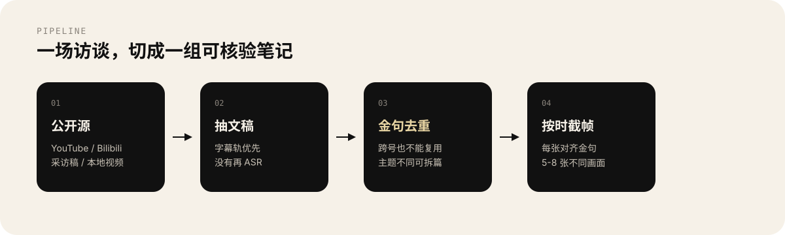

<p align="center">
  
</p>

一套 Agent Skill：从可核验的公开访谈抽出金句，写成笔记正文，再按**每句金句对应的视频时段**截不同画面，切成 5–8 张 1080×1440 花卷字幕条。第一版只落到本地，不自动发到任何平台。

适配 Cursor、Claude Code、Codex、OpenClaw、qclaw 等能加载 `SKILL.md` 的 Agent。

[中文](#中文) · [English](#english)

---

## 中文

<p align="center">
  
</p>

<p align="center">
  
</p>

给两个号共用同一条生产线：`tech`（创业 / 管理 / 商业）和 `women`（成长 / 关系 / 能量）。人物池是开放的，种子名单只是冷启动，不是白名单。

和「随便生成金句图」的差别在机制，不在口号：

| 机制 | 做法 |
| --- | --- |
| 原话可核验 | 没有公开源就不做这个人；禁止编造名人原话 |
| 画面真实 | 从访谈视频按金句时段截帧，不用 AI 生成假访谈画面；每张主体图尽量不同 |
| 金句硬去重 | 同一段原话跨号也不能再用 |
| 冷却 | 同一人在同一号默认 7 天；同场拆篇可同日生产 |
| 停在边界 | 下载失败就停，不绕过登录、付费墙、加密 |

产出目录：

```text
{content_root}/{tech|women}/{日期}-{人物}-{短标题}/
  文稿.md
  01.png
  02.png
```

<p align="center">
  
</p>

### 安装

```bash
npx skills add sxyfe/skills@xhs-interview-cards -g -y
```

或把本目录软链到 Agent 的 skills 路径：

```bash
ln -sfn "$(pwd)/xhs-interview-cards" ~/.cursor/skills/xhs-interview-cards
ln -sfn "$(pwd)/xhs-interview-cards" ~/.claude/skills/xhs-interview-cards
ln -sfn "$(pwd)/xhs-interview-cards" ~/.codex/skills/xhs-interview-cards
ln -sfn "$(pwd)/xhs-interview-cards" ~/.openclaw/skills/xhs-interview-cards
ln -sfn "$(pwd)/xhs-interview-cards" ~/.qclaw/skills/xhs-interview-cards
```

### 依赖

| 项 | 要求 |
| --- | --- |
| Python | 3.9+，`pip install -r requirements.txt`（Pillow） |
| ffmpeg | 抽帧、抽音轨 |
| yt-dlp | 仅下载已确认的公开页；失败就改用本地文件 |
| 中文字体 | macOS 系统字体可直接用；Linux 需 Noto Sans CJK 或文泉驿 |
| 可选 | bun + `baoyu-youtube-transcript`；`video-subtitle-parser`；mlx-whisper |

### 本机配置

不要把本机绝对路径写进仓库。复制示例配置，改成品目录：

```bash
cp config.example.json config.local.json
```

```json
{
  "content_root": "~/xhs-interview-cards-output"
}
```

也可用环境变量：`export XHS_INTERVIEW_CONTENT_ROOT=~/xhs-interview-cards-output`

### 第一条成功命令

```bash
python3 scripts/cli.py status
```

在 Agent 里可以直接说：「出今日候选」或「用这个访谈链接做一篇」。Agent 按 `SKILL.md` 走：先候选、你确认源，再抽文稿、去重、出图、入库。

常用命令：

```bash
python3 scripts/cli.py cooldown --account tech --person '梁文锋'
python3 scripts/cli.py transcript --url 'https://...' --out-dir "$CONTENT_ROOT/_cache/transcripts/id"
python3 scripts/cli.py check-quotes --quotes quotes.json
python3 scripts/cli.py compose --video lecture.mp4 --cards cards.json --out-dir ./out
```

<p align="center">
  
</p>

- 不承诺涨粉、爆款或收入
- 不把 cookie、登录态、手机号写进配置或仓库
- 文稿提取失败时，不使用浏览器登录态去绕过限制
- 公开访谈二次创作仍可能受肖像权、版权和平台规则约束；本 skill 不提供法律意见
- 涉及未成年人、色情、仇恨或谣言的源直接丢弃

完整约束见 [`SKILL.md`](SKILL.md) 与 [`references/safety.md`](references/safety.md)。

### License

MIT — 见 [LICENSE](LICENSE)

---

## English

<p align="center">
  
</p>

An agent skill that turns a **verifiable public interview** into a note plus 5–8 caption strips (1080×1440). Each card is cropped from the **quote’s own timestamp**, not copied from a single frame. It writes to disk only. It does not auto-post.

Install:

```bash
npx skills add sxyfe/skills@xhs-interview-cards -g -y
```

Configure a local output root in `config.local.json` (gitignored) or `XHS_INTERVIEW_CONTENT_ROOT`, then run:

```bash
python3 scripts/cli.py status
```

Hard limits: no invented celebrity quotes, no AI-fake interview frames, no login/paywall bypass, no growth or income promises.

MIT — see [LICENSE](LICENSE)
