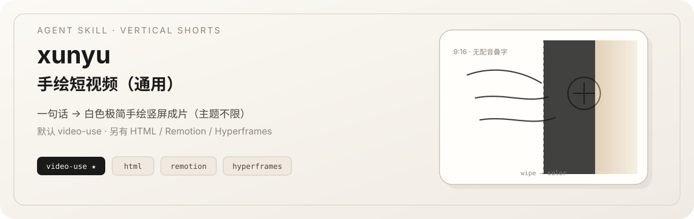
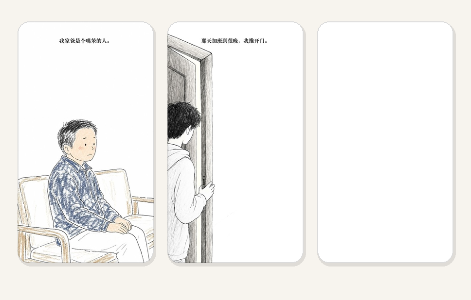
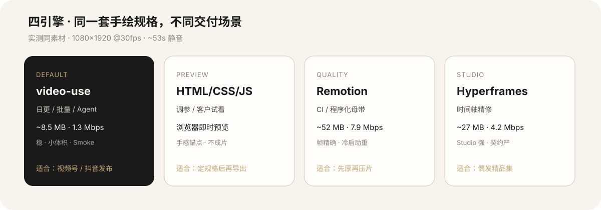

<p align="center">
 
</p>

**一句话：** 用自然语言生成「白色极简手绘」竖屏短视频——**主题通用**，不限题材。默认 **video-use** 出片；同一套规格可切 **HTML / Remotion / Hyperframes**，适配预览、日更、母带、工作室四种场景。

## 30 秒上手

对任意已安装本 skill 的 Agent 说：

```text
做一条手绘短视频，大概一分钟
```

或本机测通（无需生图 API）：

```bash
bash ~/.cursor/skills-cursor/xunyu-hand-drawn-healing-story/scripts/smoke_render.sh
```

Agent 最多问 **1** 个问题；否则用默认值直接跑。完整步骤见 [`SKILL.md`](./SKILL.md) 与 [`references/pipeline.md`](./references/pipeline.md)。

---

<p align="center">
 
</p>

<p align="center"><sub>实测成片截帧（video-use）· 1080×1920 · 无配音叠字 · wipe + 可选上色</sub></p>

---

<p align="center">
 
</p>

## 和其他手绘视频 skill 的区别

同类 skill（如 `handdraw-story-video` / 单一 HyperFrames 暖心故事流水线）往往：**引擎写死、流程偏长、主题偏窄、要先配 BGM / 生图才能跑通**。

本 skill 刻意做反：

| 维度 | 常见手绘视频 skill | **xunyu** |
| --- | --- | --- |
| 入口 | 填模板 / 多步脚本 | **一句话自然语言**，缺省不问 |
| 测通 | 必须真图 + 完整依赖 | **`mode=smoke` 占位也能出短 mp4** |
| 成片引擎 | 通常锁死一种（多为 HyperFrames） | **四种**：video-use ★ / HTML / Remotion / Hyperframes |
| 画幅 | 常见 720×960 等 | **9:16 · 1080×1920**（视频号 / 抖音友好） |
| 主题 | 单一题材模具（如暖心好事） | **主题通用**：10 示例 + 任意自拟 |
| 音频 | 常内置或强制选 BGM | **默认静音**；配乐留给平台后期 |
| Agent | 偏单一运行时 | **多端 soft-link**（Cursor / Claude / Agents…） |
| 视觉 | 线稿上色故事（题材常写死） | **白色极简手绘（通用）**（叠字 + wipe + 可选上色） |

**选择建议：** 要「暖心好事 + HyperFrames 固定流水线」→ 用既有 good-deed / handdraw-story skill。要「手绘竖屏日更 + 一句话出片 + 多引擎场景切换」→ 用 **xunyu**。

---

<p align="center">
 
</p>

## 四种成片方式：详细优缺点

> 实测样本：同素材、同动效规格（wipe + bw→color + 顶部旁白）、1080×1920 @30fps · ~53s · 静音。 
> 样本目录（可选本地脚手架）：`./samples/episode-01-four-engines/exports/`

| 产物 | 体积（约） | 约视频码率 |
| --- | --- | --- |
| Remotion | ~52 MB | ~7.9 Mbps |
| HyperFrames | ~27 MB（另有 2160 母带更大） | ~4.2 Mbps |
| **video-use** | **~8.5 MB** | **~1.3 Mbps（CRF18）** |
| HTML | 浏览器预览；成片需录屏或其它引擎 | — |

**一句话选型：** 日常发布 → **video-use**；先对手感 → **HTML**；要厚画质 → **Remotion**；要时间轴工作室 → **Hyperframes**。

### 摘要表

| 方式 | 码率/体积 | 手感 | 稳定性 | 调参成本 | 视频号/抖音批量 | 本 skill 默认？ |
| --- | --- | --- | --- | --- | --- | --- |
| **video-use** | 小（~1.3 Mbps） | 与 HTML 几乎等价 | 批出片稳 | 改参需重跑 shell | **最适合** | **是（推荐）** |
| **HTML/CSS/JS** | 无原生 mp4 | 对标最强（mask） | 预览稳 | **最低** | 仅试看/调参 | 预览推荐 |
| **Remotion** | 高（~8 Mbps） | 与 HTML 一致 | 帧精确，冷启动重 | 中（React） | 适合 CI/程序化 | 提画质时用 |
| **Hyperframes** | 中（~4 Mbps） | GSAP 接近 | Studio 强，契约严 | 高（依赖/校验） | 偶发精品 | Studio 时用 |

<details>
<summary><strong>1) video-use（默认 · ffmpeg）— 展开</strong></summary>

**是什么** 
默认成片路径：PIL/脚本生成旁白 PNG，再用 ffmpeg `xfade=wipeleft` + color fade + overlay 合成竖屏 mp4。脚本在 `scripts/`；`smoke_render.sh` 可用占位图快速测通。

**怎么跑**

```bash
SKILL=~/.cursor/skills-cursor/xunyu-hand-drawn-healing-story

# 测通（可无素材）
bash "$SKILL/scripts/smoke_render.sh"

# 全量
python "$SKILL/scripts/make_captions.py" --shots shots.json --out out/captions \
 --font "$SKILL/assets/fonts/ZCOOLKuaiLe-Regular.ttf"

ASSETS=./素材 OUT=./out EXPORTS=./exports \
SHOTS_JSON=./shots.json CAPTIONS=./out/captions SLUG=ep01 \
WIPE_DUR=1 COLOR_ST=0.85 COLOR_DUR=0.8 \
bash "$SKILL/scripts/render_ffmpeg.sh"
```

**优点**

1. 批出片稳：无 Node 冷启动，依赖少（ffmpeg + Python），适合日更批量。 
2. 体积友好：同片约 8.5MB / ~1.3Mbps，上传与手机预览压力小。 
3. 手感对齐：wipe + 上色与 HTML/Remotion 观感接近，够用发布。 
4. 调参可脚本化：`WIPE_DUR` / `COLOR_*` / `CRF` 环境变量即可。 
5. Smoke 可测通：无真图也能出短 mp4，降低 Agent 闭环失败率。

**缺点**

1. 改动效要重跑 shell，没有时间轴 GUI。 
2. 码率偏低，大屏「厚实感」不如 Remotion。 
3. 本机 ffmpeg 若无 `drawtext`，需走旁白 PNG（本 skill 已默认此路径）。 
4. 复杂缓动/多层合成弱于 Remotion/Hyperframes。

**适合：** 日更、批量、要「能发」优先于「母带级画质」。 
**推荐：** **默认。** `engine: video-use`

</details>

<details>
<summary><strong>2) HTML / CSS / JS — 展开</strong></summary>

**是什么** 
纯前端竖屏舞台：CSS `mask` 左→右揭示，双层 opacity 做 bw→color，顶部旁白淡入。零构建，浏览器即时预览。

**怎么跑**

```bash
cp -R ~/.cursor/skills-cursor/xunyu-hand-drawn-healing-story/templates/html ./预览-html
# 编辑 main.js 的 SHOTS；素材 → assets/
open ./预览-html/index.html
```

**优点**

1. 调参最快：改 wipe/上色秒看。 
2. 零依赖：无需 npm/ffmpeg，试看成本最低。 
3. 动效真相源：四种方式里手感锚点。 

**缺点**

1. **不成片**：要 mp4 需录屏或另走其它引擎。 
2. 字体跨机可能不一致。 
3. 无法直接进平台批量上传流水线。 

**适合：** 定规格、对客户演示，再交给 video-use/Remotion。 
**推荐：** 预览首选，非默认成片。`engine: html`

</details>

<details>
<summary><strong>3) Remotion — 展开</strong></summary>

**是什么** 
React 声明式视频：同一套 mask + opacity 逻辑，帧精确渲染 H.264。适合程序化批量与 CI。

**怎么跑**

```bash
cp -R ~/.cursor/skills-cursor/xunyu-hand-drawn-healing-story/templates/remotion ./02-remotion
cd ./02-remotion
npm install && npm start # Studio
npm run render # → out/*.mp4
```

**优点**

1. 码率高、画质厚：同片约 52MB / ~7.9Mbps。 
2. 帧精确、组件可复用。 
3. 手感与 HTML 一致。 

**缺点**

1. 冷启动/渲染重，日更成本高于 video-use。 
2. 体积大，直传短视频平台往往过冗余。 
3. 依赖 Node + Chrome。 

**适合：** CI、程序化，或「先高质量母带再压片」。 
**推荐：** 提画质时用。`engine: remotion`

</details>

<details>
<summary><strong>4) Hyperframes — 展开</strong></summary>

**是什么** 
HTML + GSAP 时间轴，经 HyperFrames CLI/Studio 浏览器合成直出 MP4。契约与校验较严。

**怎么跑**

```bash
cp -R ~/.cursor/skills-cursor/xunyu-hand-drawn-healing-story/templates/hyperframes ./03-hyperframes
cd ./03-hyperframes
npm install && npm run check && npm run render
```

**优点**

1. Studio 时间轴强，适合精细调 GSAP。 
2. 直出 MP4，码率中等（~27MB / ~4.2Mbps）。 
3. 与网页动效同构；`check` 可减少低级错误。 

**缺点**

1. 渲染最重，日更批量不划算。 
2. 契约严，踩坑成本高。 
3. draft 可能 2× 分辨率，交付前需缩放。 

**适合：** 工作室微调、偶发精品集。 
**推荐：** Studio/精品时用。`engine: hyperframes`

</details>

实现约定与目录模板 → [`references/engines.md`](./references/engines.md)。

---

<p align="center">
 
</p>

## 推荐工作流

```text
1. 一句话（或选 themes.md 主题）→ 分镜 + shots.json
2. smoke：占位测通 或 full：生图（bw+color）→ make_captions.py
3. （可选）engine=html 调 wipe / 上色手感
4. engine=video-use → 出片发视频号 / 抖音
5. 偶发：Remotion 提画质 或 Hyperframes Studio 精修
```

自媒体发布默认交付：**H.264 · 1080×1920 · 30fps · AAC 可选但本 skill 默认无音轨**（平台后期加 BGM）。

---

## Install（多 Agent）

```bash
# 推荐：从 GitHub / skills.sh 安装
npx skills add sxyfe/skills@xunyu-hand-drawn-healing-story -g -y

# 仅 Cursor
npx skills add sxyfe/skills@xunyu-hand-drawn-healing-story -g -y -a cursor
```

仓库：https://github.com/sxyfe/skills/tree/main/xunyu-hand-drawn-healing-story  
目录页：https://skills.sh/sxyfe/skills

本地开发也可直接软链本目录到各 Agent 的 skills 路径。


---

## 默认要点

| 项 | 值 |
| --- | --- |
| 视觉规格 | 白色极简手绘（通用 · 主题不限） |
| `mode` | `smoke`（测通）\| `full`（真生图） |
| 引擎 | **video-use**（另：`html` / `remotion` / `hyperframes`） |
| BGM | **none**（用户后期自配） |
| 画幅 | 9:16 · 1080×1920 · 30fps · ~50s / 6–9 镜（默认 7） |
| 字体 | `assets/fonts/ZCOOLKuaiLe-Regular.ttf`（OFL） |
| 参考图 | **不内置**进 skill |
| 密钥 | `.env` / `~/.config/xunyu-hand-drawn-healing-story/config.env` |

项目根 `config.yaml` 浅合并覆盖 `assets/defaults.yaml`。键释义 → [`references/defaults.md`](./references/defaults.md)。主题池 → [`references/themes.md`](./references/themes.md)。

---

## 仓库结构

```text
xunyu-hand-drawn-healing-story/
├── SKILL.md # NL 入口 + Smoke 决策树
├── README.md # 本文件
├── assets/
│ ├── defaults.yaml
│ ├── fonts/ # OFL 站酷快乐体
│ └── readme/ # README 视觉资产
├── references/ # pipeline / engines / themes / …
├── scripts/ # smoke_render / make_captions / render_ffmpeg
├── templates/ # html / remotion / hyperframes
└── evals/
```

---

## 安全与许可

- 不向仓库提交 API key / `.env`。 
- 字体：见 `assets/fonts/OFL-ZCOOLKuaiLe.txt`。商用前确认授权。 
- 成片默认静音；平台配乐由用户后期完成（见 [`references/bgm.md`](./references/bgm.md)）。
